# Enterprise Employee Agent — Development Framework

**Version:** 2.1  
**Date:** 2026-09-12  
**Status:** active for v0.1  
**Product source:** `docs/spec-employee-agent.html` v0.2

This document adapts the original Enterprise Policy Agent framework to the current project. It
defines the development process, architecture boundaries, artifacts, checks, and release gates.
The product spec defines behavior; `PLAN.md` defines delivery order and current status.

Original source: <https://drive.google.com/file/d/1WM9HSwQuu-tCHiwcgM5LshuD0qxTIFG1/view>

## 1. Product and process decision

We are building one complete vertical:

1. A US employee asks a leave-of-absence question.
2. The assistant answers from the frozen, allowed GitLab Handbook corpus and cites evidence.
3. It collects only the fields needed for an educational request and shows a versioned preview.
4. The employee explicitly confirms that preview.
5. A typed command creates one idempotent local request in SQLite.
6. Employee, manager, and HR receive different authorized projections.
7. HR can start processing or request clarification; the manager is read-only in v0.1.

The system does not determine legal eligibility and does not integrate with Tilt, Okta, GitLab
IAM, or an HRIS. Public GitLab documents and synthetic protected fixtures demonstrate mechanics;
they do not prove production access control.

Development follows:

**Spec → PLAN/BACKLOG → groomed Issue → implementation plan → code → tests/eval → independent
QA → owner acceptance → merge → verify main → done.**

Ceremony follows risk. Bootstrap and small documentation corrections may use a short path.
Changes to retrieval, prompts, authorization, request state, confirmation, persistence, or role
projections require the full path and relevant behavioral checks.

## 2. Sources of truth

| Artifact | Authority |
|---|---|
| `docs/spec-employee-agent.html` | User behavior, v0.1 scope, roles, quality and release gates |
| `DEVELOPMENT_FRAMEWORK.md` | Development process and architecture boundaries |
| `PLAN.md` | Delivery order, dependencies, current phase and release checklist |
| `BACKLOG.md` | Prioritized initiatives not yet represented by an Issue |
| GitHub Issue | One result, acceptance criteria, scope and verification |
| Pull request | Change, evidence, independent QA and owner acceptance |
| `AGENTS.md` | Rules and commands needed in every coding session |
| `docs/decisions/` | Long-lived decisions not obvious from the current spec |
| `evals/` | Versioned cases, annotation rules, thresholds and reports |

If documents disagree, do not silently choose an interpretation. Product scope follows the
latest explicit owner decision recorded in the spec. Update dependent documents before writing
code that relies on it.

`BACKLOG.md` holds the prioritized initiative index until the corresponding GitHub Issues exist.
Create an Issue for active implementation work, then make the Issue authoritative for its task
state and acceptance criteria; do not maintain two live backlogs afterward. Drive is only the
source of the original framework. This file in the repository is the canonical adapted version.

### Project preflight

Before the first code or documentation change, or any GitHub write, complete a project
preflight:

1. Read `AGENTS.md` and every document it marks as required for the task.
2. Identify the canonical process source, the current delivery stage, and the next gate.
3. Reconcile the latest handoff with this framework, `PLAN.md`, and the active GitHub Issue.
4. Resolve material conflicts in the canonical artifact before implementation continues.

A handoff is evidence and navigation, not authority for the next action. An Issue is actionable
only after it satisfies the Definition of Ready. Until preflight is complete, repository reading
and other read-only inspection are allowed; code/document changes and GitHub writes are not.

Before an external write or a transition to another lifecycle stage, state one short control
line:

> Stage: `<stage>`. Required documents: read. Next allowed action: `<action>`. Merge:
> `<allowed or blocked, with reason>`.

The line records the decision at a meaningful boundary. It is not required before each read-only
inspection.

## 3. Architecture

The product is a typed workflow with an LLM-assisted knowledge layer. The model proposes an
answer and structured fields. Deterministic code owns identity, authorization, validation,
confirmation, idempotency, transitions, storage, and role-specific output.

```mermaid
flowchart LR
    UI[UI and server-selected demo identity] --> APP[Application service]
    APP --> AUTH[Authorization]
    AUTH --> RET[Allowed-document retrieval]
    RET --> LLM[LLM answer and field extraction]
    LLM --> VAL[Schema and citation validation]
    VAL --> PRE[Clarification or versioned preview]
    PRE --> CMD[Confirmed typed command]
    CMD --> STORE[SQLite transaction and audit event]
    STORE --> VIEW[Role-specific projection]
    VIEW --> UI
```



### Required boundaries

- Identity comes from a server-side demo fixture. User text and model output cannot set actor
  identity or role.
- Authorization runs before retrieval, before a command, and before rendering a result.
- Forbidden fields and documents never enter the model context for that actor.
- The LLM cannot call the database or perform a state transition directly.
- Model output is schema-validated. Provider and validation failures leave workflow state
  unchanged.
- Every material answer cites an allowed existing fragment that supports it or states that the
  source cannot establish the answer.
- A request mutation, idempotency record, and audit event commit atomically.
- Role projections are explicit typed outputs, not model-generated redactions.

### Leave workflow contract

```text
draft -> submitted -> processing
draft -> cancelled
submitted -> needs_clarification -> submitted
```

No other transition belongs to v0.1 without a product decision. The manager does not approve or
reject leave.

Commands contain `actor_id`, `request_id` when applicable, expected request version, an
idempotency key, and a typed payload. The minimum set covers draft create/update, draft cancel,
confirmed submit, HR start-processing, HR request-clarification, and employee clarification.

Draft edits may be stored without a separate confirmation because they do not submit the
request. Submission confirms the normalized payload, version, and digest shown in the preview.
Any draft change invalidates the preview. An answer to clarification produces a new preview
before resubmission.

An idempotency key is scoped to actor and operation. Repeating the same key and payload returns
the original authorized result without a second event. Reusing it with a different payload
returns a conflict. After interruption, the client checks state and retries with the same key.

### Shared and leave-specific code

Share only boundaries required by v0.1: the LLM adapter, evidence contract, authorization
interface, confirmation envelope, idempotent command handling, audit event format, and eval
result format. Keep leave fields, prompts, transitions, questions, and projections inside the
leave domain. A second workflow must demonstrate repetition before introducing a general
workflow engine.

## 4. Project structure

Use one installable Python package with a `src` layout. Create folders when they gain real
content.

```text
src/enterprise_employee_agent/
    app.py                  # component composition
    config.py
    access/                 # identity, authorization, role projections
    knowledge/              # corpus, chunking, retrieval, evidence
    leave/                  # models, commands, state machine, use cases
    llm/                    # provider-neutral client and validation
    prompts/                # packaged, versioned prompt files
    storage/                # SQLite repositories, transactions, migrations
    web/                    # HTTP/UI boundary when selected
tests/{unit,integration,e2e,fixtures}/
evals/{cases,datasets}/
data/{source,synthetic_protected}/
experiments/
docs/{specs,decisions,plans,agents}/
```

Python models are authoritative for runtime contracts. Generate JSON Schema when an external
interface needs it; do not maintain the same schema manually in two places. Prompt files live
inside the package and are explicitly included in package configuration.

Avoid generic root-level `agents/`, `tools/`, and `schemas/` buckets. Names should expose domain
responsibility. Business code does not import a provider SDK directly. HTTP handlers contain no
business rules.

FastAPI, a minimal UI, and Docker Compose are introduced for the portfolio demo. SQLite is
sufficient for the local single-instance application. Postgres, a broker, vector database,
LangGraph, Kubernetes, and a general tool registry require demonstrated need.

## 5. Toolchain and commands

Bootstrap uses Python 3.12 after checking dependency compatibility, `uv` for the environment and
lockfile, `pytest` for tests, and Ruff for lint and formatting.

`AGENTS.md` is created during foundation/bootstrap, before application code and before the first
working Issue. It stays short: only rules, commands, boundaries, and reading order needed in
every coding session. Product behavior, task state, and long-lived decisions stay in their
canonical artifacts instead.

When the project is used with Claude Code, `CLAUDE.md` is a compatibility adapter: by default it
contains only `@AGENTS.md`. Add only Claude-specific runtime instructions there, such as a local
hook or permission constraint; do not duplicate shared project context.

```bash
uv sync --locked
uv run --locked ruff check .
uv run --locked ruff format --check .
uv run --locked pytest
```

The Makefile exposes:

- `make check` — lint and format check;
- `make test` — deterministic tests;
- `make eval-smoke` — offline end-to-end scenario with a fake adapter;
- `make eval` — explicitly configured live evaluation;
- `make demo` — local application.

A target is added when implemented. A missing or skipped required command is not a successful
check. Dependencies change through `uv add` or `uv add --dev` and include the lockfile.

CI starts with the first executable pull request. It performs locked installation, Ruff, unit
and integration tests, and the available offline smoke evaluation. Live model evaluation remains
separate because it needs secrets and a cost budget.

## 6. Git workflow

`main` is the always-verifiable integrated version. The project has no permanent `dev` branch.
After a GitHub remote exists, each task starts from current `main` in one branch:

```text
feat/<issue>-<slug>     # user-visible functionality
fix/<issue>-<slug>      # defect correction
docs/<issue>-<slug>     # documentation and specifications
chore/<issue>-<slug>    # bootstrap, dependencies, CI, maintenance
```

One logical change is one Conventional Commit in English: `feat:`, `fix:`, `docs:`, `test:`, or
`chore:`. The branch carries the Issue identifier after Issues exist. Before the first remote,
foundation documents and bootstrap may be committed directly to local `main`.

After the remote exists, product behavior, retrieval, access rules, workflow state, persistence,
and CI reach `main` through a pull request. The Engineer creates the branch and PR with the
change and verification evidence; QA reviews its current head; the authorized integrator squash
merges after required QA PASS and owner acceptance. Verify `main` after merge before closing the
Issue.

The pull request template records the linked Issue, verification evidence, CI result, independent
QA verdict bound to the reviewed head revision, owner acceptance, and intended squash merge.
Unchecked boxes are visible status, not evidence. CI and branch protection enforce the checks
that GitHub can verify; the integrator verifies the recorded human gates before merge.

Repository settings allow squash merge only and delete merged head branches. Protection for
`main` requires a pull request, the successful `checks` status check, linear history, and blocks
force-push and deletion, including for administrators. If the hosting plan cannot enforce these
rules for a private repository, record that limitation in the active Issue and PR; the integrator
must verify CI and every recorded gate manually until protection becomes available.

Do not amend, rebase, stage, commit, or push unrelated changes in a dirty worktree. A remote is
created as private unless the owner explicitly selects another visibility. Adding a remote and
pushing it are external actions performed only with owner authorization.

## 7. Task lifecycle

### Full path

Use this path for user-visible behavior, data, prompts, retrieval, permissions, workflow state,
persistence, dependencies, packaging, and release infrastructure.

1. Owner selects the milestone and delegation boundary.
2. PM/Groomer connects the task to the spec, limits scope, defines acceptance criteria and
   verification, and marks it Ready only when prerequisites exist.
3. Engineer records a short plan, implements the smallest coherent change, and provides
   reproducible evidence.
4. QA independently reads the Issue, spec, diff, and evidence; reruns focused checks; and returns
   PASS, FAIL, or BLOCKED for the current head revision.
5. Owner accepts the user-visible result or requests rework.
6. The authorized integrator merges, verifies main, and closes the Issue.

One workflow label is active: `draft`, `ready`, `in-progress`, `review`, `blocked`, `done`, or
`cancelled`. QA verdict and experiment decision are separate fields.

### Short path

Bootstrap, typo fixes, link repairs, and small documentation corrections may combine grooming,
implementation, and review. They still require a clear expected result, diff review, and relevant
command or content check. Independent QA and owner acceptance remain required when the change
alters a product contract, permission, safety rule, metric, or release gate.

### Definition of Ready

A task is Ready when it has one observable result; testable acceptance criteria and material
edge cases; explicit scope and non-goals; available dependencies and data; defined verification
and live-eval budget; and no unresolved product decision. An experiment also identifies its
hypothesis, baseline, dataset version, metric, threshold, and decision rule.

### Issue template

```markdown
## Goal / why now
One observable result and its priority.

## References
- Spec section/version:
- Initiative/milestone:
- Dependencies:

## Scope
- In scope:
- Out of scope:
- Constraints and risks:

## Acceptance criteria
- [ ] AC-1
- [ ] AC-2 / material edge case

## Verification
- Unit/integration:
- Eval slice/dataset:
- Security/regression:
- Manual/domain review:

## Implementation plan
1. ...

## Ready/open decisions
- Unresolved decisions: none
- Scope authority:
```

The repository's Issue form implements this structure for groomed work and applies `ready` only
after every required field and Definition of Ready check is completed. Earlier initiatives stay
in `BACKLOG.md` with `draft` status until grooming is complete.

## 8. Roles and handoff

| Role | Output | Boundary |
|---|---|---|
| Owner | Scope, priority, product decisions, acceptance | Does not replace required domain review |
| PM/Groomer | Ready task with testable criteria | Does not write product code or broaden scope |
| Engineer | Code, checks, evidence and handoff | Does not accept its own work or weaken criteria |
| QA | Independent PASS/FAIL/BLOCKED with evidence | Does not repair implementation during review |
| Integrator | Merge and verification on main | Does not merge without required verdicts |
| Orchestrator | Assignment, transitions, limits, recovery | Does not make product decisions or issue QA PASS |

One AI tool may perform different roles in separate fresh contexts. Switching roles inside the
Engineer's continuing response is not independent QA.

The handoff records task/PR, base and head revisions, completed behavior, commands and results,
eval IDs, limitations, and next action. QA binds its verdict to the same head revision,
acceptance-criteria revision, corpus manifest, prompt version, and eval config. Relevant changes
invalidate stale QA or eval evidence; unaffected evidence may be reused only when applicability
is recorded.

## 9. Tests and evaluation

Eval-first means recording expected behavior before changing model-dependent behavior. It does
not require finishing the release benchmark before the first small implementation.

| Change | Required evidence |
|---|---|
| Documentation | Diff, links, consistency with canonical sources |
| State, validation, authorization, projections | Unit and required integration tests |
| Prompt, model, retrieval, chunking, citations | Tests, behavioral eval and safety regression |
| Corpus or annotations | Provenance/annotation review, new version, recalculated results |
| Packaging, dependency or CI | Clean locked installation and affected commands |
| API/UI | Contract/integration checks and material user states |

Start with 10–15 reviewed micro-eval cases so the first retrieval baseline can run early. Expand
to roughly 30–40 before v0.1 release and keep a held-out subset unused for tuning. Cover normal
questions, missing information, unsupported eligibility, unknown jurisdiction, prompt injection,
forbidden disclosure, stale confirmation, duplicate submission, provider failure, and role views.

Before a retrieval run define the corpus manifest and stable fragment IDs; chunking version;
retrieval parameters including `k`; all acceptable supporting fragments; treatment of questions
with no answer; model, prompt, parameters, repeats, cost/token budget, and timeout.

Report percentages with absolute counts and an error table. Repeats of one case do not become
independent cases. Initial thresholds remain 90% for retrieval Recall@k, groundedness,
abstention, and task success. Deterministic authorization, confirmation, transition,
idempotency, and forbidden-disclosure checks must pass 100%; averages cannot compensate for
these failures.

Compare the assisted journey with a structured form baseline: does the assistant find evidence,
ask useful clarification, and produce a valid request without unsafe or unnecessary steps?

Every live result records code revision, corpus/dataset/prompt versions, prompt hash, model ID
and known provider revision, parameters, run ID, usage, cost, latency, raw outcomes, and failures.
An experiment ends with `KEEP`, `REVERT`, or `INVESTIGATE` and a concrete next action.

## 10. Data, model, and security rules

The first corpus contains only the GitLab Handbook US leave documents needed by the scenario.
`data/manifest.json` records source URL and revision, retrieval time, licence, path, hash, stable
document ID, and normalization/chunking version. Raw imports are immutable; derived content is
reproducible.

Synthetic protected documents, identities, manager relationships, and sensitive fields are
clearly labelled fixtures. They test the demonstration permission manifest without implying real
GitLab access.

Corpus text, retrieved text, model output, and uploaded content are untrusted data. They cannot
change system instructions, identity, permissions, acceptance criteria, or workflow rules.

All provider calls use one client with timeouts, bounded retries for transient failures, usage
logging, and safe domain errors. Unit and CI tests do not call a provider. Structured output is
schema-validated; after one bounded repair attempt, an invalid response fails without changing
state.

Secrets come from environment/configuration and never enter Git, fixtures, prompts, traces, or
reports. Logs exclude free-text sensitive fields and hidden model reasoning. Exact field-level
employee, manager, and HR projections form a versioned contract and are tested at the
serialization boundary. Authorization also applies to idempotent result replay and audit history.

## 11. Definition of Done

A task is Done when its current acceptance criteria pass; applicable tests and evals pass;
required checks are present; independent QA and owner acceptance are recorded where applicable;
affected contracts, manifests, docs, and reports are updated; the change is integrated; required
main checks pass; and the Issue records the outcome and limitations.

The v0.1 release additionally requires the checklist in `PLAN.md`: clean-clone launch, Docker
Compose with persistent SQLite state, offline CI, full role-aware demo, live baseline and held-out
report, corpus provenance, and documented limitations.

## 12. Orchestration

Start with a supervised sequential workflow. The owner or existing coding harness selects a
Ready task and starts PM/Groomer, Engineer, and QA in separate contexts as needed. A custom
orchestrator is not a v0.1 prerequisite.

Automated coordination begins only after the manual process demonstrates an unambiguous Ready
task and handoff; PASS, FAIL, BLOCKED and owner rework; recovery after interruption; rejection of
stale evidence; reconciliation with Issue/branch/PR/main; real exit codes, timeouts, attempt/token/
cost limits and human stop; and a measurable reduction in manual work at acceptable quality.

Automation records Issue ID, stage, branch/head revision, role, attempt count, run ID, budget use,
and last event. It never changes scope, criteria, thresholds, or permissions to obtain PASS. By
default, two repair cycles after the first QA failure are allowed; then the task becomes BLOCKED.
Parallel execution requires independent Issues, isolated write areas, branches/worktrees, stable
interfaces, an integration owner, and verification of the combined result.

## 13. Initial delivery route

| Order | Initiative | Exit criterion |
|---|---|---|
| 1 | Reconcile and bootstrap | Spec, framework, PLAN and AGENTS agree; package installs; first test and CI pass |
| 2 | Corpus manifest | US leave source is frozen with licence, revision, hashes and stable fragment IDs |
| 3 | Workflow contract | Identities, field projections, commands, states, confirmation and errors are explicit |
| 4 | Micro-eval contract | Reviewed cases, held-out split, annotation guide, metrics and budgets exist |
| 5 | Retrieval/answer baseline | Simplest reproducible baseline produces an error table |
| 6 | Deterministic workflow | Authorization, confirmation, idempotency, transitions and persistence pass tests |
| 7 | First vertical slice | Fake-adapter flow completes submission, HR processing and role views |
| 8 | Integrated assistant | Knowledge answer and typed workflow use one application service |
| 9 | Portfolio interface | UI exposes identity, evidence, preview version, confirmation and status |
| 10 | v0.1 release | Docker, clean-clone run, offline CI, held-out live eval and README evidence pass |
| Later | Development automation | Manual lifecycle and recovery justify an orchestrator experiment |
| Later | Second domain | v0.1 evidence shows which abstractions repeat |

The first end-to-end acceptance slice is:

**employee edits draft → receives versioned preview → confirms → receives `submitted` → the
request survives restart → manager sees only allowed fields → HR starts processing.**

Implement it first with a deterministic fake LLM adapter. Add retrieval and live model behavior
through their own measured tasks.

## 14. Changing this framework

After the first complete task cycle and each milestone, review unclear criteria, unnecessary
handoffs, repeated work, stale evidence, missed failures, cost, and recovery. Change this file in
a small reviewed task with a reason. Preserve planning, prioritization, grooming, independent QA,
and acceptance while simplifying steps that do not improve delivery.

Complete one small, observable, verified result; automate only the parts of that cycle that have
become stable.
